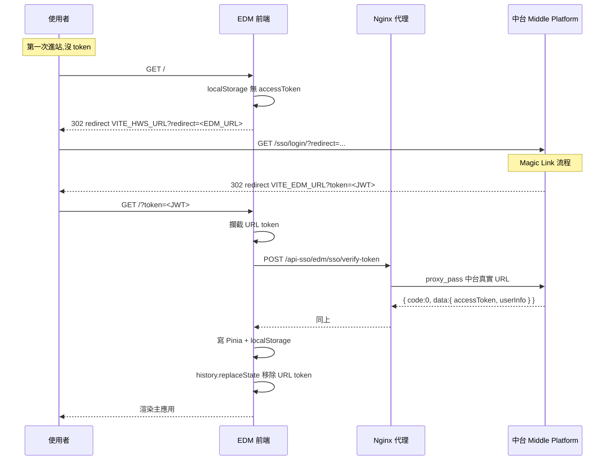
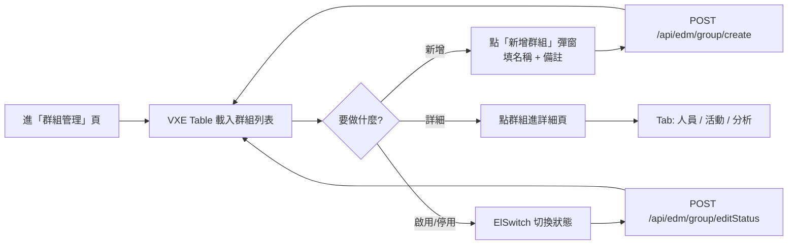
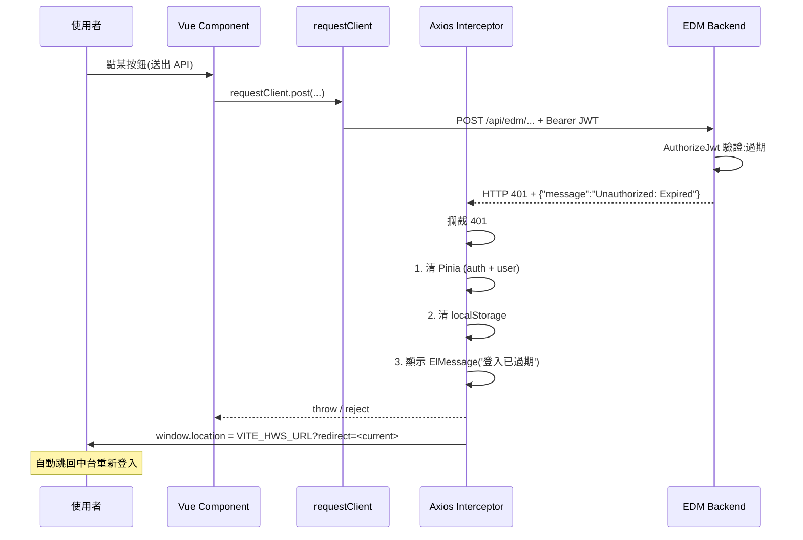

# User Flow

本文件從**使用者視角**描述 EDM Frontend 的關鍵流程,包含 SSO 進站、業務操作、Token 失效應對。

目標讀者:**UX、前端開發者、SA**。

---

## 1. SSO 進站流程(Activity Diagram)

「使用者第一次點開 EDM,系統怎麼處理沒登入這件事?」

```mermaid
flowchart TD
    start([👤 使用者打開 EDM<br/>http://edm.example/])

    check_url{URL 上有 ?token= ?}
    has_token_in_storage{localStorage 有 accessToken ?}

    redirect_sso[302 redirect 到中台<br/>VITE_HWS_URL?redirect=<current_url>]
    sso_login[使用者在中台完成<br/>Magic Link 登入]
    sso_redirect_back[中台 302 回 EDM<br/>?token=<jwt>]

    intercept_url[攔截 URL token]
    call_verify[POST /api-sso/edm/sso/verify-token<br/>(走 nginx 代理到中台)]

    verify_ok{中台回 200<br/>code=0 ?}
    save_state[寫入 Pinia + localStorage<br/>accessToken / userInfo]
    clean_url[history.replaceState<br/>移除 URL 上的 ?token=]

    render_app[渲染 EDM 主應用]

    show_error[ElMessage.error<br/>'登入失敗,請重試']

    start --> check_url

    check_url -- 是 --> intercept_url
    check_url -- 否 --> has_token_in_storage

    has_token_in_storage -- 有 --> render_app
    has_token_in_storage -- 沒有 --> redirect_sso

    redirect_sso --> sso_login
    sso_login --> sso_redirect_back
    sso_redirect_back --> start

    intercept_url --> call_verify
    call_verify --> verify_ok
    verify_ok -- 是 --> save_state
    verify_ok -- 否 --> show_error
    show_error --> redirect_sso
    save_state --> clean_url
    clean_url --> render_app
```

**關鍵設計細節**

| 步驟 | 為什麼這樣做 |
|---|---|
| 攔截 URL token | 避免 token 留在 browser history、Referer header、access log |
| 走 `/api-sso/` 代理 | 對外隱藏中台真實位址(資安) |
| 寫 Pinia + localStorage | Pinia(memory)用於 reactive UI 更新,localStorage 用於 refresh / 重開 tab 後維持 session |
| `history.replaceState` 移除 token | 不留在 URL 上,即使被截圖、被同事看到也不洩漏 |

---

## 2. SSO 登入時序(Sequence)

跟 [`architecture.md` Level 4](./architecture.md#level-4--sso-登入時序) 同一張 sequence,這裡再放一次方便對照流程圖閱讀。



---

## 3. 業務操作流程(典型場景)

### 3.1 群組管理



### 3.2 人員 Excel 批次匯入

```mermaid
flowchart LR
    enter[進「人員管理」頁]
    open_modal[點「Excel 匯入」]
    pre_select[預選目標群組<br/>(必填,鎖定)]
    select_file[選 Excel 檔]
    parse[ExcelJS 解析欄位]
    preview[預覽前 10 列<br/>確認欄位對映]
    confirm[使用者確認]
    api[批次 POST /api/edm/member/add<br/>每 100 筆一批]
    result[顯示結果<br/>成功 X / 失敗 Y]

    enter --> open_modal --> pre_select --> select_file --> parse --> preview --> confirm --> api --> result
```

**為何要「預選群組鎖定」**:防止行銷人員一次匯入後忘記選群組,造成歸類錯誤。鎖定後,該批匯入的所有人員都自動加入這個群組。

### 3.3 活動建立 → 寄邀請信

```mermaid
flowchart TD
    create_event[建立活動<br/>填表 + CKEditor 寫內容]
    upload_img[上傳活動圖片]
    save[POST /api/edm/event/create]
    detail[進活動詳細頁]

    invite_step{邀請名單從哪來?}
    import_group[從群組匯入<br/>POST /api/edm/event/importGroup]
    manual_add[手動新增 member]

    create_form[(可選)建 Google 報名表<br/>POST /api/edm/event/createGoogleForm]

    edit_mail[CKEditor 編輯邀請信內文<br/>支援變數 {name}, {event_title}]
    preview_mail[預覽信件]
    send_mail[POST /api/edm/mail/inviteMail]
    queued[後端回「已加入隊列」]

    create_event --> upload_img --> save --> detail
    detail --> invite_step
    invite_step -- 群組 --> import_group
    invite_step -- 手動 --> manual_add
    import_group --> create_form
    manual_add --> create_form
    create_form --> edit_mail --> preview_mail --> send_mail --> queued
```

> **重點**:`inviteMail` API 是**非同步**的 — 立即回 200,實際寄送由後端 Worker 從 `jobs` table 撈出來執行。詳見 [edm_backend sequence-diagrams.md 第 2 節](../../edm_backend/docs/sequence-diagrams.md#2-寄送活動邀請信)。

---

## 4. Token 失效流程

「使用者操作中,JWT 過期了會發生什麼?」



**設計考量**

- **不嘗試靜默 refresh**:目前中台沒給 refresh token(只簽 access),所以無法 refresh,只能重登
- **顯示提示再跳轉**:給 0.5 秒讓使用者看到提示,避免「莫名其妙跳走」的困惑
- **記住當前 URL**:跳回中台時帶 `?redirect=<current>`,登完後直接回到原來操作的頁

> 未來中台支援 refresh 後,可以在 401 時先嘗試 refresh,只有 refresh 也失敗才跳回中台。對應 [edm_backend ADR-0001](../../edm_backend/docs/adr/0001-jwt-shared-secret.md) 的 Roadmap。

---

## 5. 登出流程

主動登出比 token 過期簡單:

```mermaid
flowchart LR
    click[點右上角「登出」]
    confirm[ElMessageBox 確認]
    clear[清 Pinia + localStorage]
    redirect[redirect 到中台 /sso/logout/]

    click --> confirm --> clear --> redirect
```

**注意**:中台的 `/sso/logout/` 只清中台的 session,**不會撤銷已簽出去的 JWT**(JWT 是無狀態的)。在 access token TTL 內,如果有人複製了 token 還是能繼續用。要立即撤銷需要走 `/api/auth/logout/`(把 refresh token 進黑名單),但 SSO 流程目前沒給 refresh token,所以這條路不通 — 接受 30 分鐘的「登出延遲」。

詳見 [Middle Platform ADR-0002](../../Middle_Platform/docs/adr/0002-jwt-vs-session.md) 的取捨討論。

---

## 6. SA 文件內嵌頁(登入後可看)

EDM 系統內也有 SA 文件頁,**登入後**可在側邊選單找到:

```
左側選單
└── SA 文件
    ├── 系統架構圖     → /sa-docs/architecture
    ├── 使用案例圖     → /sa-docs/use-case
    ├── 需求說明       → /sa-docs/requirement
    ├── API 文件       → /sa-docs/api
    └── ER 圖          → /sa-docs/er-diagram
```

這些頁面渲染 Mermaid 圖,內容跟本目錄的 Markdown 同步(Markdown 為正本)。
